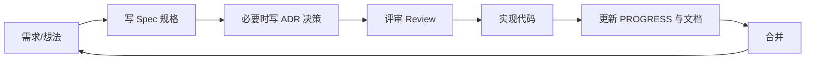

# Runi 文档体系（Documentation-Driven Development）

本项目采用 **文档驱动开发（DDD, Documentation-Driven Development）**：任何功能或重大改动，先写/改文档，评审达成一致后再写代码；代码合并时同步更新文档。文档是"单一事实来源（Single Source of Truth）"。

## 工作流

1. **先文档后代码**：新功能先在 `docs/specs/` 写规格；涉及架构/选型的决策写 `docs/adr/`。
2. **小步评审**：规格/决策评审通过后再开工，避免返工。
3. **代码即文档的延伸**：PR 必须同步更新相关文档与 [PROGRESS.md](PROGRESS.md)。
4. **可追溯**：每个 Spec / ADR 有唯一编号，代码注释或 commit 可引用，例如 `ref: ADR-0002`。

## 目录结构

| 路径 | 用途 |
|------|------|
| [plan.md](plan.md) | 最初的产品需求（不可变历史） |
| [technical-plan.md](technical-plan.md) | 总体技术规划 |
| [agent-plan.md](agent-plan.md) | Agent 循环/工具调用的详细设计与分阶段计划 |
| [research-report.md](research-report.md) | Agent 化改造前的技术调研报告（ADR-0003 决策依据） |
| [PROGRESS.md](PROGRESS.md) | 阶段进度与任务看板（持续更新） |
| [adr/](adr/) | 架构决策记录（Architecture Decision Records） |
| [specs/](specs/) | 功能规格说明 |
| [adr/_template.md](adr/_template.md) | ADR 模板 |
| [specs/_template.md](specs/_template.md) | Spec 模板 |
| [superpowers/specs/](superpowers/specs/) | 逐任务设计说明（按日期命名，配合下面的实现计划） |
| [superpowers/plans/](superpowers/plans/) | 逐任务实现计划（会话级 TODO，完成状态以 PROGRESS.md/Spec 为准） |
| [chrome-store-permission-justifications.md](chrome-store-permission-justifications.md) | Chrome 应用商店权限申请理由说明 |
| [privacy-policy.md](privacy-policy.md) / [privacy-policy.en.md](privacy-policy.en.md) | 隐私政策（中 / 英） |
| [chrome-store-listing.zh-CN.md](chrome-store-listing.zh-CN.md) / [chrome-store-listing.en.md](chrome-store-listing.en.md) | 商店商品详情文案（中 / 英，可直接粘贴） |
| [chrome-store-submission-guide.md](chrome-store-submission-guide.md) | Chrome 应用商店上架操作指南（账号注册/素材/Dashboard 表单/审核） |
| [chrome-store-release-checklist-1.1.md](chrome-store-release-checklist-1.1.md) | 1.1 发布前的打包/合规/素材核对清单 |
| [store-assets/](store-assets/) | 商店图标、截图与宣传图素材 |

## 约定

- 文档语言：中文为主，关键术语保留英文。
- 文件命名：ADR 用 `NNNN-标题.md`（四位序号）；Spec 用 `NNNN-标题.md`。
- 状态标记：`草稿 Draft` / `已接受 Accepted` / `已废弃 Deprecated` / `已实现 Implemented`。
- 一旦 Accepted，不直接删改历史决策；如需变更，新增一条 ADR 并在旧 ADR 标注 `被 ADR-XXXX 取代`。
