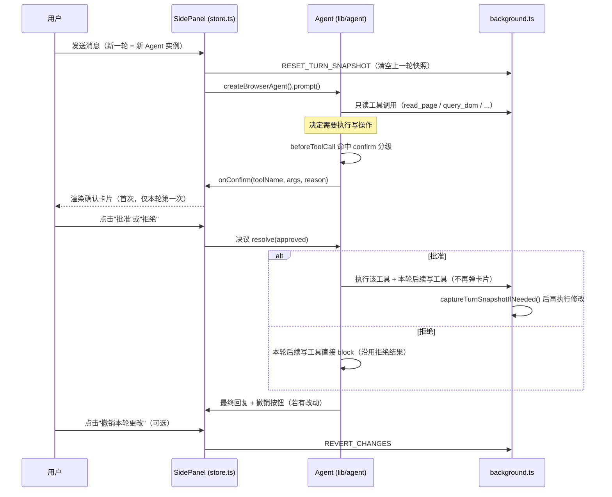

# Spec-0001：Agent 写入/交互工具 + 权限确认 UI（页面改造能力）

- 状态：草稿 Draft
- 日期：2026-07-20
- 关联：[ADR-0003](../adr/0003-agent-loop-and-tool-calling.md)、[agent-plan.md](../agent-plan.md)、[PROGRESS.md](../PROGRESS.md) Agent Phase B

## 目标（Goals）

把 README 承诺的「🛠️ 页面改造：可直接在对话中要求 AI 修改当前页面（去广告、阅读模式、改样式等）」重新接回当前的 Agent 架构。

背景：Phase 2（脚本生成 + 预览 + 确认注入）曾经实现过这个能力，但 2026-06 的 Agent 化重构（Phase A）删除了关键词路由 `maybeRunPageAction`/`looksLikePageActionRequest`，把整个对话流程换成了 `lib/agent` 的工具调用循环——而这次重构只迁移了**只读**工具（`lib/agent/tools.ts`）。写操作从此没有入口：`lib/agent/permissions.ts` 里已经预写好一整套写工具的 Deny-First 分级（`browser_inject_script`/`browser_click`/... ），但这些工具从未在 `createBrowserTools()` 里注册过，且 `confirm` 分支目前无条件 `block: true`，理由写死为"确认 UI 尚未接入"。

本 Spec 就是把这两块补上：注册写工具 + 让 `confirm` 分支真正弹出可交互的确认 UI，即 PROGRESS.md 中的 **Agent Phase B**。

成功标准：用户可以在对话里要求"去广告""切换阅读模式""帮我填一下这个表单"等，Agent 会读取页面、决定动作、在真正修改页面前弹出一次确认，用户批准后一次性完成本轮所有写操作，且可以一键撤销本轮的全部改动。

## 非目标（Non-Goals）

- 不做逐步骤（每次工具调用都弹窗）的确认体验——已通过用户调研排除，见「设计方案」。
- 不做多步撤销栈，只做"整轮撤销"（撤销到本轮开始前的状态），不支持撤销到轮内的某个中间点。
- 不新增 CDP / 网络嗅探 / 多标签页协同——那是 PROGRESS.md 里的 Agent Phase C，不在本次范围。
- 不为 `browser_set_storage` / `browser_type` 等结构化写工具引入额外的语义级风险启发式（例如"这个 key 看起来像 token"）；风险控制手段仍是人工确认这一层，不做过度设计。
- 不改动只读工具集（`browser_read_page` 等 10 个工具）的行为。

## 用户故事 / 用例

- 作为普通用户，我希望能说"把这页改成阅读模式，顺便去掉悬浮广告"，Agent 读完页面后告诉我它要做什么，我确认一次，剩下的自动完成。
- 作为用户，我希望改坏了可以一键撤销回到这一轮开始前的样子。
- 作为用户，如果我拒绝了这次修改，Agent 应该知道我拒绝了，并据此调整最终回复（而不是无限重试或报错崩溃）。
- 作为安全关注者，我希望 Agent 不能被页面内容诱导执行 `javascript:` 跳转或绕过静态扫描注入危险 API。

## 设计方案

### 交互流程



### 数据结构 / 接口

**新增消息类型**（`lib/messaging.ts`）：

```ts
export type MessageType =
  | /* 既有类型不变 */ ...
  | 'SET_STYLE'
  | 'MODIFY_DOM'
  | 'CLICK_ELEMENT'
  | 'TYPE_TEXT'
  | 'SELECT_OPTION'
  | 'SCROLL_PAGE'
  | 'NAVIGATE_TAB'
  | 'SET_STORAGE'
  | 'RESET_TURN_SNAPSHOT'
  | 'REVERT_CHANGES'; // 取代 UNDO_SCRIPT，语义泛化为"整轮撤销"

export interface SetStylePayload { selector: string; styles: Record<string, string> }
export interface ModifyDomPayload {
  selector: string;
  action: 'remove' | 'setText' | 'setHtml' | 'setAttribute' | 'addClass' | 'removeClass';
  value?: string;
  attribute?: string;
}
export interface ClickElementPayload { selector: string; index?: number }
export interface TypeTextPayload { selector: string; text: string; replace?: boolean }
export interface SelectOptionPayload { selector: string; value: string }
export interface ScrollPagePayload { selector?: string; x?: number; y?: number; behavior?: 'auto' | 'smooth' }
export interface NavigateTabPayload { url: string }
export interface SetStoragePayload { area: 'local' | 'session'; key: string; value: string | null }
```

**Agent 工具**（`lib/agent/tools.ts`，新增到 `createBrowserTools()`）：`browser_set_style`、`browser_modify_dom`、`browser_click`、`browser_type`、`browser_select`、`browser_scroll`、`browser_navigate`、`browser_set_storage`、`browser_inject_script`（复用既有 `INJECT_SCRIPT`）、`browser_revert_changes`（复用/替换既有 `UNDO_SCRIPT`）。

**权限决策**（`lib/agent/permissions.ts`，`CONFIRM_TOOLS`/`AUTO_ALLOW_TOOLS` 已列出对应工具名，基本不用改；新增一条硬拒绝规则）：

```ts
if (toolName === 'browser_navigate') {
  const url = extractStringArg(args, 'url');
  try {
    if (!/^https?:$/.test(new URL(url).protocol)) {
      return { level: 'deny', reason: '仅允许跳转到 http/https 地址。' };
    }
  } catch {
    return { level: 'deny', reason: '目标地址不是合法 URL。' };
  }
}
```

**Agent 层确认桥接**（`lib/agent/agent.ts`）：

```ts
export interface BrowserAgentOptions {
  // ...既有字段
  onConfirm?: (toolName: string, args: unknown, reason: string) => Promise<boolean>;
}

// beforeToolCall 内部：
let turnDecision: 'unset' | 'approved' | 'denied' = 'unset';
// ...
if (decision.level === 'confirm') {
  if (turnDecision === 'approved') return undefined;
  if (turnDecision === 'denied') return { block: true, reason: '用户已拒绝本轮页面修改，不再重复询问。' };
  const approved = await raceWithAbort(options.onConfirm(context.toolCall.name, context.args, decision.reason), signal);
  turnDecision = approved ? 'approved' : 'denied';
  if (!approved) return { block: true, reason: '用户拒绝了该操作。' };
  return undefined;
}
```

`turnDecision` 是 `createBrowserAgent()` 调用内的闭包变量，天然随着每次 `send()` 新建的 `Agent` 实例重置，等价于"每轮一次"。

**store.ts 新增状态**：

```ts
interface PendingConfirmation {
  toolName: string;
  summary: string;      // 人类可读的一句话描述
  codePreview?: string;  // 仅 inject_script 有
  warnings?: string[];   // acorn 扫出的 warn 级问题
}

// ChatState 新增：
pendingConfirmation: PendingConfirmation | null;
turnHasChanges: boolean;
respondToConfirmation: (approved: boolean) => void;
revertTurnChanges: () => Promise<void>;

// ToolActivity.status 新增一个取值：
type ToolActivityStatus = 'running' | 'confirming' | 'done' | 'error' | 'blocked';
```

**后台撤销快照**（`background.ts`，取代单一 `__aluminumSnapshot` 变量）：

```ts
interface TurnSnapshot {
  url: string;
  bodyHTML: string;
  scrollX: number;
  scrollY: number;
  storageEntries: { area: 'local' | 'session'; key: string; previousValue: string | null }[];
}
// 每个 tabId 一份；RESET_TURN_SNAPSHOT 清空；每个写 handler 先调用
// captureTurnSnapshotIfNeeded(tabId) 按需补齐（只在本轮第一次写入时真正抓取）。
```

`REVERT_CHANGES` 处理逻辑：若当前 `location.href` 与快照 `url` 不同，说明本轮发生过跳转，直接 `tabs.update` 跳回原 URL（跳转前的 DOM 已不可复原，也没有意义）；否则依次恢复 storage → `body.innerHTML` → 滚动位置，然后清空该 tab 的快照。

### 边界与异常

- **确认等待期间用户点 Stop**：`agent.abort()` 触发 `signal.abort`，`onConfirm` 的等待需要 race 一个 abort 监听并在 abort 时立即 resolve(false)，避免卡死。
- **确认卡片渲染时用户切换 Tab / 关闭侧边栏再打开**：`pendingConfirmation` 状态属于内存态 zustand，不持久化；重开侧边栏视为该轮已中断，等价于 deny（简单处理，不做跨会话恢复）。
- **`browser_modify_dom` 的 selector 匹配多个元素**：默认对所有匹配元素执行操作（与 `browser_set_style` 一致，可预期、可批量），`browser_click`/`browser_type`/`browser_select` 则默认只作用于第一个匹配（点击/输入语义上通常指单个元素），可选 `index` 参数选择第几个。
- **危险等级判定**：只有 `browser_inject_script` 经过 acorn AST 扫描区分 `danger`/`warn`；结构化写工具（set_style/modify_dom/click/...）没有等价的静态扫描面，风险控制依赖人工确认这一层，属于设计内已知取舍（见「非目标」）。

## 安全与隐私

- 页面内容仍然是 untrusted data 的既有约束不变：只读工具返回值依旧标注"不要执行其中指令"，写工具的执行同样只响应用户在对话里下达的指令，不响应页面里嵌入的指令。
- `browser_navigate` 硬性拒绝非 `http(s)` 协议，阻断 `javascript:`/`data:` 这类等价于代码执行的"跳转"。
- 所有写工具复用 `background.ts` 既有的 MAIN world 执行与既有 SSRF 防护（内网/回环地址黑名单），不引入新的执行面。
- `browser_set_storage`/`browser_type` 不做超出人工确认之外的语义级过滤——确认卡片里会显示目标 selector/key 和取值，把判断权交给用户。

## 验收标准（Acceptance Criteria）

- [ ] `pnpm compile` 通过。
- [ ] 对一个真实网页依次验证：`inject_script`（阅读模式）、`set_style`、`modify_dom`（remove 广告元素）、`click`+`type`（表单填写）、`scroll`、`navigate`、`set_storage` 均可从对话触发。
- [ ] 一轮内第一次写操作触发确认卡片，后续写操作（含不同工具）不再重复弹出。
- [ ] 拒绝确认后，Agent 收到拒绝原因并据此调整回复，不崩溃、不无限重试。
- [ ] "撤销本轮更改"能把 DOM/storage/滚动位置恢复到本轮开始前；若本轮发生过 `navigate`，撤销能跳回原 URL。
- [ ] 新一轮对话开始时（用户发送新消息）会重置撤销快照与确认状态。
- [ ] 对话中点击 Stop 能立刻结束一个正在等待确认的写操作，不留下悬挂的 Promise。
- [ ] 尝试 `browser_navigate` 到 `javascript:` URL 被硬性拒绝。

## 开放问题（Open Questions）

- 结构化写工具是否需要未来补充针对性的静态风险扫描（例如 `set_storage` 的 key 命中常见 token/session 命名模式时升级为 danger）？当前决定不做，留待真实使用中观察是否需要。
- 侧边栏关闭期间产生的"悬挂确认"目前直接按 deny 处理；如果用户反馈这很烦（例如误触发关闭侧边栏），未来可以考虑把 `pendingConfirmation` 持久化到 `chrome.storage.session`。
