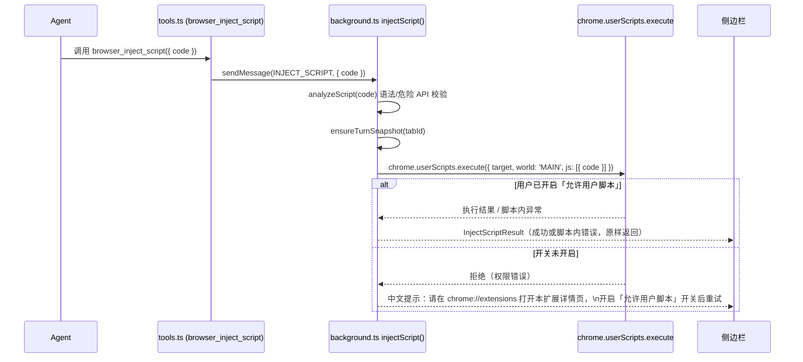

# Spec-0002：Chrome 应用商店合规改造 —— browser_inject_script 迁移至 chrome.userScripts

- 状态：已实现 Implemented（2026-07-24 全部验收标准通过，含 2026-07-23 等待重试增强，见 [PROGRESS.md](../PROGRESS.md)）
- 日期：2026-07-21
- 关联：docs/chrome-store-permission-justifications.md、docs/privacy-policy.md、CLAUDE.md（安全边界章节）

## 背景

计划将 Aluminum 上架 Chrome 应用商店。审计发现 `entrypoints/background.ts` 的 `injectScript()`
当前使用 `browser.scripting.executeScript({ world: 'MAIN', func: ... new Function(userCode) ... })`
在页面 MAIN world 中执行 LLM 生成的脚本文本。

Chrome Web Store《Manifest V3 附加要求》明确禁止"使用 eval() 或其他机制执行来自远程来源的字符串"，
且 `new Function()` 与 `eval()` 在该政策下被视为等同。LLM API 返回的代码文本属于"远程来源"，因此
现有实现构成 Remote Hosted Code 政策违规。该政策的加强执行将于 **2026-08-01** 生效。

唯一官方认可的例外通道是 `chrome.userScripts` API ——该 API 是 Chrome 专为"运行用户/AI 动态提供的
脚本"这一场景设计的合规执行路径。Chrome 138+ 起，用户只需在扩展详情页开启一次性的
「允许用户脚本」（Allow User Scripts）开关即可使用，不再需要开启全局开发者模式。

## 目标（Goals）

- 将 `browser_inject_script` 的执行机制从 `new Function()` 迁移到 `chrome.userScripts.execute()`，
  消除 Remote Hosted Code 政策违规，同时保留"注入并执行自定义脚本"这一能力本身。
- 用户未开启「允许用户脚本」开关时，给出清晰、可操作的中文错误提示。
- 不改变现有安全纵深：`analyzeScript` 静态扫描、每轮一次确认闸门、执行前快照与撤销机制均保持不变。
- 同步更新相关文档（权限说明、PROGRESS、CLAUDE.md），确保文档与实现一致。

## 非目标（Non-Goals）

- 不改动其余 9 个结构化写工具（`browser_set_style`/`modify_dom`/`click`/`type`/`select`/`scroll`/
  `navigate`/`set_storage`/`revert_changes`）的实现。
- 不做"提前检测开关状态并主动展示引导横幅"的 UI（已与用户确认：采用被动报错方案，而非主动检测）。
- 不收窄 `host_permissions: ["<all_urls>"]` 的范围——该权限已判定为核心功能（对任意当前网页提供
  AI 能力）所必需，审计仅要求准备好详细理由说明（已存在于
  `docs/chrome-store-permission-justifications.md`），不涉及代码变更。
- 不在本 Spec 内覆盖 Chrome 应用商店上架全流程（开发者账号注册、Listing 素材制作、Dashboard
  隐私问卷填写、提交与审核跟进）。该部分不涉及代码改动，将在本 Spec 实现完成后作为独立的操作
  清单交付。

## 用户故事 / 用例

- 作为 Aluminum 用户，当我要求 AI"切换到阅读模式"等没有对应结构化工具覆盖的页面改造时，AI 仍
  应能注入并执行自定义脚本完成该操作，且这一能力应符合 Chrome 最新政策，不会导致扩展审核被拒
  或上架后被下架。
- 作为开发者，我希望在 2026-08-01 政策强制生效前完成迁移，避免因政策变更导致上架失败或已上架
  应用被处置。

## 设计方案

### 交互流程



### 数据结构 / 接口

`InjectScriptPayload` / `InjectScriptResult`（`lib/messaging.ts`）**不变**——仅替换
`injectScript()` 函数体内部的执行机制，对外协议无变化：

```ts
// 不变
export interface InjectScriptPayload {
  code: string;
}
export interface InjectScriptResult {
  result?: string;
  snapshotSaved: boolean;
}
```

`wxt.config.ts` manifest 变更：

```ts
permissions: ['sidePanel', 'storage', 'scripting', 'activeTab', 'tabs', 'userScripts'],
minimum_chrome_version: '138',
```

### 边界与异常

- **开关未开启**：`chrome.userScripts.execute()` 拒绝执行 → 捕获该特定错误 → 包装为中文提示，
  引导用户前往 `chrome://extensions` 打开本扩展详情页开启「允许用户脚本」。此提示通过现有的
  工具错误展示路径呈现，不新增 UI 组件。
- **脚本语法错误**：`analyzeScript` 前端权限层（`permissions.ts`）与后端 `injectScript()` 仍各自
  校验一次，行为与现状一致。
- **脚本运行时异常**：捕获后原样返回 `error` 字段，行为与现状一致。

## 安全与隐私

- `chrome.userScripts` 与 `new Function()` 在"能执行任意 JS"这一点上语义等价，本次改动**不降低
  也不提高**脚本本身的能力边界，只是把执行通道换成 Chrome 官方认可的合规路径。
- 现有安全纵深（`analyzeScript` 静态扫描危险 API 并提示、每轮一次确认闸门、执行前快照支持一键
  撤销）全部保持不变。
- 新增的 `userScripts` 权限需要用户在扩展详情页手动开启一次开关，这是 Chrome 强制的额外用户同意
  步骤，扩展无法绕过，也不应尝试绕过。

## 验收标准（Acceptance Criteria）

- [x] `wxt.config.ts` 的 `manifest.permissions` 包含 `'userScripts'`，并设置
      `manifest.minimum_chrome_version: '138'`
- [x] `entrypoints/background.ts` 的 `injectScript()` 使用 `chrome.userScripts.execute()`，
      不再使用 `browser.scripting.executeScript` + `new Function()`
- [x] 「允许用户脚本」开关关闭时，触发 `browser_inject_script` 的用户体验清晰
      （**行为已在 2026-07-23 升级为等待+自动重试**，不再是一次性报错，见
      [2026-07-23-turn-tabid-pinning-and-userscripts-wait-design.md](../superpowers/specs/2026-07-23-turn-tabid-pinning-and-userscripts-wait-design.md)；
      手动验证：2026-07-24 按该设计对应实现计划的 Task 9 Step 2 五个子步骤在真实 Chrome 里逐一验证通过）
- [x] `pnpm compile` 与 `pnpm test` 通过
- [x] `pnpm build` 产物 `.output/chrome-mv3/manifest.json` 中包含 `userScripts` 权限
- [x] `docs/chrome-store-permission-justifications.md` 补充 `userScripts` 权限说明（中英双语，
      格式与现有条目一致）
- [x] `docs/PROGRESS.md` 变更日志新增一行记录本次迁移
- [x] `CLAUDE.md`"安全边界"章节中关于 MAIN world 隔离执行的描述同步更新
- [x] 手动在真实 Chrome（版本 ≥ 138）中验证：开关关闭时等待重试、开关开启后自动完成注入并可被
      `browser_revert_changes` 撤销、取消等待、孤儿轮询检查——全部通过（2026-07-24）

## 开放问题（Open Questions）

- `chrome.userScripts.execute()` 的返回值语义（脚本最后一条语句的完成值）与当前
  `new Function(userCode)` 包裹执行后的 `return` 语义是否完全一致，需要在实现阶段通过实测确认；
  如有差异，需调整脚本包裹方式（例如仍用 `new Function` 包裹一层用于统一取返回值语义，但内部
  改为通过 `userScripts.execute` 调度而非直接 `scripting.executeScript`——具体取舍留给实现阶段
  依据实测结果决定）。
- Chrome 应用商店上架全流程操作指南（账号注册、Listing 素材、Dashboard 隐私表单、提交与审核
  跟进）将在本 Spec 实现完成、代码通过验收后，作为独立的操作清单单独交付，不阻塞本 Spec 的评审
  与实现。
