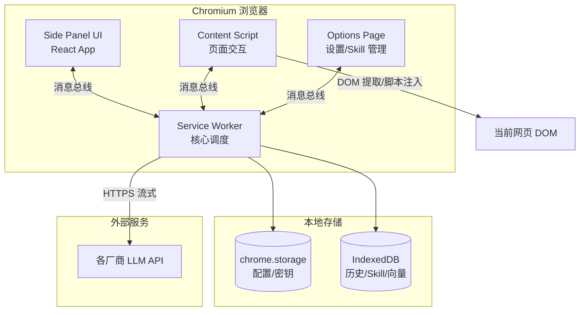
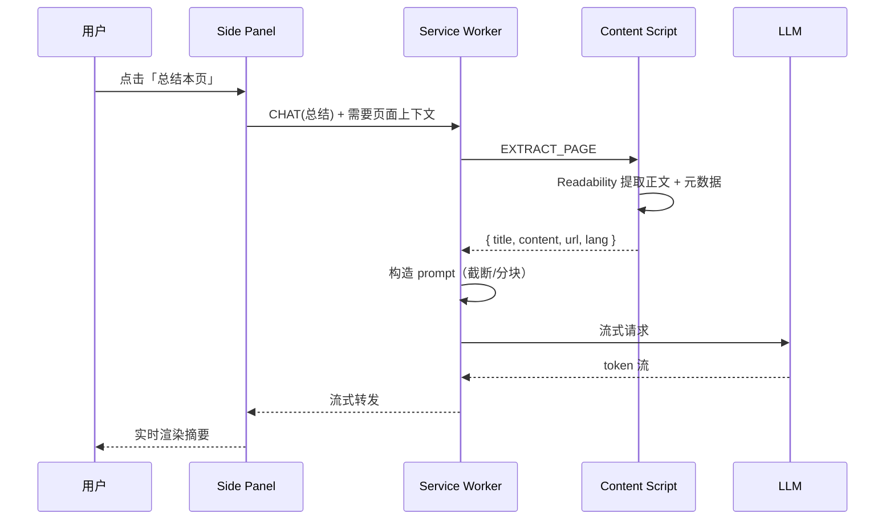
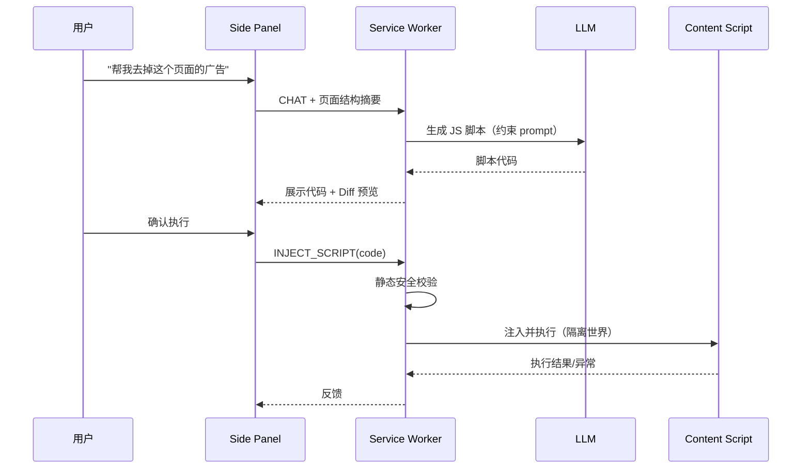

# Runi —— Chromium 浏览器 AI 助手插件 技术规划

> 基于最初的产品需求（plan.md，已于 2026-08-22 归档删除）给出可落地的技术架构、模块划分、技术选型与分阶段实施计划。

---

## 1. 产品概述

Runi 是一个面向 Chromium 系浏览器（Chrome / Edge / Brave 等）的浏览器扩展，以**侧边栏 AI 对话框**为核心交互形态，借助大模型能力帮助用户理解、改造并自动化当前网页。

### 1.1 核心能力

| # | 能力 | 说明 |
|---|------|------|
| 1 | 页面总结 | 提取当前页面正文，生成摘要 / 要点 |
| 2 | 页面理解辅助 | 解释名词、翻译、问答（基于页面上下文 RAG） |
| 3 | 脚本注入 | 由 LLM 生成脚本，注入当前页面（去广告、改样式、阅读模式等） |
| 4 | Skill 固化与管理 | 将固定操作沉淀为可复用 Skill，提供增删改查与执行 |
| 5 | 轻量网页自动化 | 批量抓取数据 / 图片 / 视频，利用扩展权限绕过部分反爬 |

### 1.2 设计原则

- **隐私优先**：API Key、对话历史默认仅存本地；页面内容仅在用户主动触发时上送 LLM。
- **多模型可插拔**：通过统一的 Provider 抽象接入各厂商 API。
- **安全沙箱**：LLM 生成脚本须经过用户确认 + 受限执行环境，防止恶意/越权操作。
- **渐进增强**：核心对话先行，自动化与 Skill 体系逐步迭代。

---

## 2. 技术选型

### 2.1 扩展平台

- **Manifest V3**（MV3）：Chromium 当前强制标准。
  - Background → **Service Worker**（事件驱动、无常驻）。
  - 侧边栏 → **Side Panel API**（`chrome.sidePanel`，Chrome 114+）。
  - 内容操作 → **Content Scripts** + **`chrome.scripting.executeScript`**。

### 2.2 前端技术栈

| 领域 | 选型 | 理由 |
|------|------|------|
| UI 框架 | **React 18 + TypeScript** | 生态成熟，组件化，类型安全 |
| 构建工具 | **Vite + [CRXJS](https://crxjs.dev/) / wxt** | MV3 HMR、零配置打包扩展 |
| 状态管理 | **Zustand** | 轻量，适合扩展多上下文场景 |
| 样式 | **Tailwind CSS + shadcn/ui** | 快速构建一致的侧边栏 UI |
| Markdown 渲染 | **react-markdown + rehype** | 渲染 LLM 输出、代码高亮 |
| 流式输出 | **fetch + ReadableStream (SSE)** | 支持 token 级流式渲染 |

> 推荐使用 **[WXT](https://wxt.dev/)** 框架统一管理 MV3 多入口（background / sidepanel / content / options），简化构建与跨浏览器发布。

### 2.3 大模型接入

- 统一 **OpenAI-Compatible** 接口为主协议，适配：
  - OpenAI / Azure OpenAI
  - Anthropic Claude
  - Google Gemini
  - 国内：DeepSeek、通义千问、智谱 GLM、Moonshot 等
  - 本地：Ollama / LM Studio（`localhost`）
- 抽象 `LLMProvider` 接口，屏蔽各家差异（鉴权、流式格式、function calling 格式）。

### 2.4 本地存储

| 数据 | 存储 | 说明 |
|------|------|------|
| API Key / 配置 | `chrome.storage.local`（加密） | 不同步到云端 |
| 对话历史 | **IndexedDB**（Dexie.js） | 大容量、可检索 |
| Skill 定义 | IndexedDB + 可导出 JSON | 支持分享/备份 |
| 页面向量缓存 | IndexedDB | 可选，用于长页面 RAG |

---

## 3. 系统架构

### 3.1 总体架构图



### 3.2 模块职责

#### Service Worker（核心调度层）
- 消息路由中心（Side Panel ↔ Content Script ↔ Storage）。
- LLM 请求编排：构造 prompt、调用 Provider、流式转发。
- Skill 执行引擎调度。
- 权限与安全校验。

#### Side Panel（交互层）
- 对话界面、消息流渲染。
- Skill 列表与一键执行入口。
- 模型/参数切换。
- 脚本生成预览与「确认执行」交互。

#### Content Script（页面交互层）
- 页面正文提取（集成 **Readability.js**）。
- DOM 元素选择 / 高亮 / 标注。
- 受控脚本注入与结果回传。
- 数据抓取（列表、图片、视频 URL）。

#### Options Page（管理层）
- Provider / API Key 配置。
- Skill 的 CRUD、导入导出。
- 隐私与权限设置。

### 3.3 通信机制

- 使用 `chrome.runtime.sendMessage` / `chrome.runtime.connect`（长连接 Port，用于流式）。
- 定义统一消息协议：

```ts
interface Message<T = unknown> {
  id: string;            // 请求唯一 ID，便于流式分片匹配
  type: MessageType;     // 'CHAT' | 'EXTRACT_PAGE' | 'INJECT_SCRIPT' | 'RUN_SKILL' | ...
  payload: T;
  stream?: boolean;
}
```

---

## 4. 核心功能技术方案

### 4.1 页面内容提取（功能 1、2 的基础）



- **正文提取**：Mozilla **Readability.js**，去除导航/广告/脚注噪声。
- **长页面处理**：
  - 优先截断（按 token 预算）。
  - 超长走 **Map-Reduce 摘要** 或 **本地向量检索（RAG）**：用 embedding（可调用厂商 embedding 接口或本地模型）切块检索相关段落。
- **名词解释/划词**：Content Script 监听 selection，右键菜单或浮层触发，将选区 + 上下文段落送 LLM。

### 4.2 脚本生成与注入（功能 3）



**安全要点（关键）**：
- LLM 生成脚本**默认不自动执行**，必须用户在预览后显式确认。
- 注入使用 `chrome.scripting.executeScript`，运行在 **ISOLATED world** 或受限 `MAIN` world。
- 静态校验：拦截危险 API（`eval`、外发请求到陌生域、读取 cookie/localStorage 上送等），可用轻量 AST 扫描（acorn）。
- 提供脚本沙箱包装：超时、try-catch、操作白名单。
- 记录执行结果；页面修改使用随扩展打包的结构化写入函数，并在每轮第一次写操作前请求确认。

### 4.3 Skill 体系（功能 4）

**Skill 数据模型**：

```ts
interface Skill {
  id: string;
  name: string;
  description: string;
  trigger: 'manual' | 'auto';      // 手动点击 or 匹配 URL 自动建议
  matchPatterns?: string[];        // 如 ["*://*.youtube.com/*"]
  type: 'script' | 'prompt' | 'workflow';
  // script: 固化的注入脚本
  // prompt: 固化的提示词模板
  // workflow: 多步骤组合（提取 → LLM → 注入/抓取）
  steps: SkillStep[];
  createdAt: number;
  updatedAt: number;
  version: number;
}

interface SkillStep {
  action: 'extract' | 'llm' | 'inject' | 'scrape' | 'wait' | 'click';
  params: Record<string, unknown>;
}
```

- **固化来源**：用户可将一次成功的脚本生成 / 对话操作「保存为 Skill」。
- **管理**：Options 页提供列表、编辑、启用/禁用、导入导出 JSON、按域名分组。
- **自动建议**：根据当前 URL 匹配 `matchPatterns`，在侧边栏顶部提示可用 Skill。
- **执行引擎**：在 Service Worker 中按 `steps` 顺序编排，串联提取/LLM/注入/抓取。

### 4.4 轻量网页自动化与抓取（功能 5）

| 抓取类型 | 技术方案 |
|----------|----------|
| 结构化数据 | Content Script 内用 LLM 生成的 CSS Selector / XPath 提取，或 LLM 直接解析 DOM 片段输出 JSON |
| 图片 | 扫描 ``、`background-image`、`srcset`、懒加载 `data-src`，去重收集 |
| 视频 | 监听 `<video>`、`source`、网络请求（`chrome.webRequest` 嗅探 m3u8/mp4） |
| 分页/批量 | Workflow：滚动加载 → 等待 → 再提取，循环直至终止条件 |

**绕过反爬的优势与边界**：
- 扩展运行在真实浏览器会话中，复用用户登录态、Cookie、真实 UA 与渲染结果 → 天然规避大量基于「无头/无 JS」的反爬。
- 通过模拟真实滚动/点击触发懒加载。
- **合规边界**：
  - 仅抓取用户有权访问的页面内容；尊重 `robots.txt` 提示（给出风险提醒）。
  - 加入频率限制，避免对目标站造成压力。
  - 不用于绕过付费墙、批量盗取版权内容；UI 中明确免责声明。

**导出**：抓取结果支持 JSON / CSV / 打包下载（图片/视频用 `chrome.downloads`）。

---

## 5. 多模型 Provider 抽象

```ts
interface LLMProvider {
  id: string;
  name: string;
  chat(req: ChatRequest): AsyncIterable<ChatChunk>;   // 流式
  embed?(texts: string[]): Promise<number[][]>;        // 可选
  supportsFunctionCalling: boolean;
  supportsVision: boolean;
}

interface ChatRequest {
  model: string;
  messages: ChatMessage[];
  temperature?: number;
  tools?: ToolSpec[];      // function calling / 工具调用
  stream: true;
}
```

- 统一适配层将各厂商响应归一化为 `ChatChunk`。
- **Function Calling / Tool Use**：把「提取页面」「注入脚本」「抓取数据」注册为工具，让模型自主决定调用（Agent 模式），同时保留人工确认关卡。
- 配置项：endpoint、apiKey、默认 model、温度、最大 token、代理。

> ⚠️ **本节方案未实现，已被 [ADR-0003](adr/0003-agent-loop-and-tool-calling.md) 取代**：`LLMProvider`/`chatWithTools()`/`ToolSpec` 从未落地，实际直接采用 `@earendil-works/pi-agent-core` 作为 Agent 循环与工具调用的基座（内置模型/工具抽象），详见 `lib/agent/agent.ts`。`lib/llm.ts` 的 `chatStream()` 保留作为历史参考，当前代码中无调用方。

---

## 6. 安全与隐私

| 风险 | 缓解措施 |
|------|----------|
| API Key 泄露 | 本地存储 + 加密（Web Crypto），不写入同步存储，不打日志 |
| 恶意/越权脚本 | 强制人工确认 + AST 静态扫描 + 隔离世界执行 |
| 页面隐私数据外送 | 仅用户主动触发上送；敏感字段（密码框、支付信息）自动脱敏/过滤 |
| Prompt 注入（页面内容操纵 LLM） | 系统提示隔离、对页面文本做角色标注（untrusted content），关键动作需用户确认 |
| 权限最小化 | `host_permissions` 按需申请，`activeTab` 优先，避免 `<all_urls>` 常驻 |
| CSP / 远程代码 | MV3 禁止远程代码执行，所有逻辑打包进扩展 |

---

## 7. 项目结构（建议，已被 ADR-0002 定案的 WXT 约定取代）

> ⚠️ 以下是早期设想，ADR-0002 定案后实际采用 WXT 的 `entrypoints/` 约定而非本节的 `src/` 布局。当前真实结构见根目录 [README.md](../README.md) 的「项目结构」一节（`entrypoints/{background,content,sidepanel,options}` + `lib/`，其中 `lib/agent/` 承载 Agent 循环与工具调用）。本节保留仅作历史参考。

```
Runi/
├── manifest.config.ts          # MV3 manifest（wxt/crxjs 生成）
├── src/
│   ├── background/             # Service Worker
│   │   ├── index.ts
│   │   ├── router.ts           # 消息路由
│   │   ├── llm/                # Provider 抽象与各家适配
│   │   ├── skill-engine/       # Skill 执行引擎
│   │   └── security/           # 脚本校验/脱敏
│   ├── sidepanel/             # 侧边栏 React 应用
│   │   ├── App.tsx
│   │   ├── components/
│   │   └── store/              # Zustand
│   ├── content/               # Content Scripts
│   │   ├── extractor.ts        # Readability 提取
│   │   ├── injector.ts         # 脚本注入
│   │   └── scraper.ts          # 数据抓取
│   ├── options/               # 设置 + Skill 管理页
│   ├── shared/                # 类型、消息协议、工具函数
│   │   ├── messages.ts
│   │   ├── types.ts
│   │   └── storage/            # Dexie / storage 封装
│   └── assets/
├── public/
├── package.json
├── tsconfig.json
├── vite.config.ts
└── tailwind.config.ts
```

---

## 8. 分阶段实施计划

> ⚠️ 方向调整（2026-06-13）：Phase 3/4/5 已被 [ADR-0003](adr/0003-agent-loop-and-tool-calling.md) 顺延/取代——转向「Agent 循环 + 工具调用」后，Skill 体系演化为「固化的工具调用序列」，自动化抓取与增强并入 Agent Phase C。当前实际进度以 [PROGRESS.md](PROGRESS.md) 的阶段总览表为准，本节以下内容仅作历史路线图参考。

### Phase 0 — 脚手架（基础设施）
- 初始化 WXT/Vite + React + TS + Tailwind 项目。
- 跑通 MV3：Side Panel 打开、Service Worker、Content Script 三端通信。
- 定义消息协议与存储封装。

### Phase 1 — MVP 对话（功能 1、2）
- 接入 1~2 个 OpenAI-Compatible Provider，流式输出。
- Options 页配置 API Key / 模型。
- Readability 页面提取 → 总结、问答、划词解释。
- 对话历史持久化（IndexedDB）。

### Phase 2 — 脚本注入（功能 3）
- LLM 生成脚本 → 预览 → 人工确认 → 注入执行。
- 安全校验、隔离执行，以及每轮第一次写操作前确认。
- 内置常用模板（去广告、阅读模式、改背景）。

### Phase 3 — Skill 体系（功能 4）
- Skill 数据模型与执行引擎。
- 「保存为 Skill」、Skill 管理页、URL 自动建议。
- 导入导出。

### Phase 4 — 自动化抓取（功能 5）
- 图片/视频/结构化数据抓取。
- Workflow 多步编排（滚动加载、分页）。
- 结果导出（JSON/CSV/批量下载）。

### Phase 5 — 增强与发布
- 多 Provider 完善、Function Calling Agent 模式。
- 长页面 RAG、向量缓存。
- 跨浏览器适配、性能优化、商店上架。

---

## 9. 关键技术风险与对策

| 风险 | 对策 |
|------|------|
| Side Panel API 浏览器兼容（旧版 Chrome / 部分分支不支持） | 提供 Popup/独立窗口降级方案 |
| Service Worker 生命周期短、易被回收 | 状态持久化到 storage；流式用长连接 Port 维持 |
| 长页面超出上下文窗口 | 截断 + Map-Reduce + RAG 分块 |
| LLM 生成脚本不可靠/有害 | 人工确认 + 静态校验 + 沙箱 |
| 各厂商 API 差异大 | Provider 抽象层归一化 |
| 反爬合规与法律风险 | 频率限制、robots 提示、免责声明、仅限有权内容 |

---

## 10. 后续可拓展方向

- 多标签页 / 跨页面任务编排。
- 本地小模型（WebGPU / WebLLM）做离线轻量任务。
- Skill 市场（社区分享）。
- 语音输入、截图理解（多模态）。
- 与浏览器书签/历史结合的个性化记忆。
